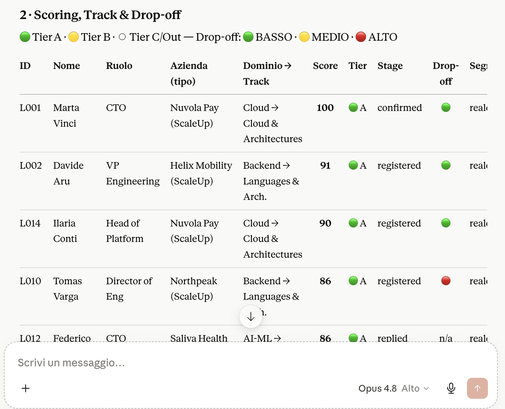
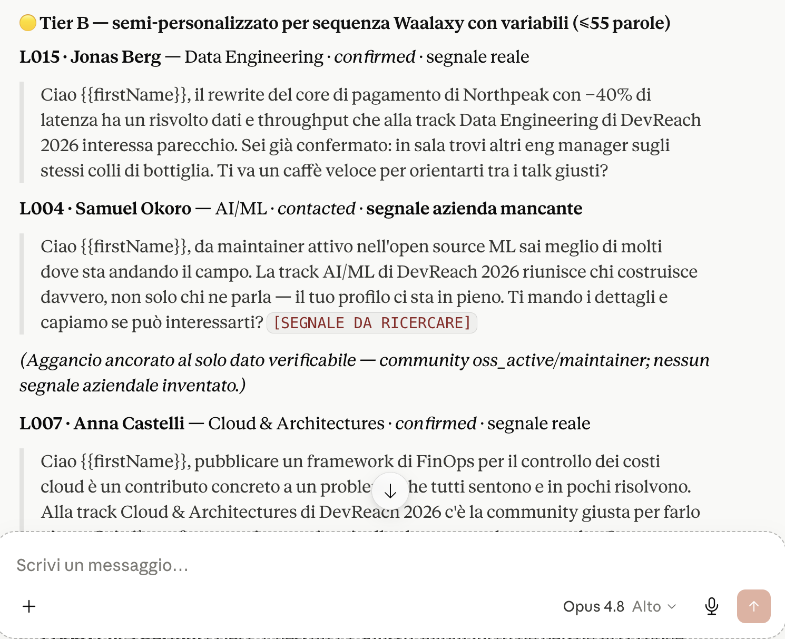
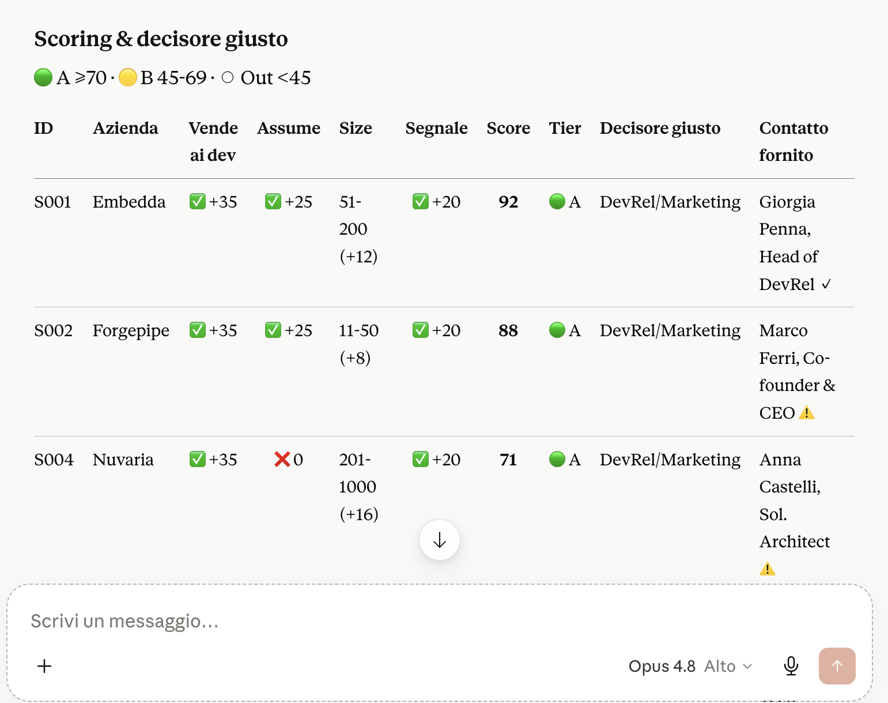

# Esempi di esecuzione reale

Questi screenshot mostrano il prompt di questo repo eseguito sul dataset
simulato in `/data` (`leaders.csv` + `sponsors.csv`). Sono esecuzioni reali,
non mockup.

**Nota di trasparenza.** I dati sono simulati a scopo dimostrativo. Il campo
`company_recent_signal` e' fornito a mano in questa versione POC;
l'arricchimento automatico del segnale e' nella roadmap. Il tool non inventa
mai un segnale: dove manca, lo dichiara.

---

### 1. Scoring deterministico dei tech leader

Ogni profilo riceve un punteggio ripetibile e un tier (A / B / C / Out) a
partire da seniority, ruolo, azienda e segnale di community. Stesso input,
stesso output: nessuna variabilita' tra una run e l'altra.

### 2. Messaggi pronti, ancorati al progetto reale del contatto

Per i Tier A il tool genera messaggi 1:1 che partono da un risultato vero della
persona (il "complimento vero"), non da testo generico. I contatti della stessa
azienda ricevono angoli diversi, per non sembrare un mailing.

### 3. Regola di grounding in azione

Quando manca il segnale aziendale, il tool NON improvvisa. Personalizza sul solo
dato verificabile (es. maintainer open source) e marca il punto aperto con
`[SEGNALE DA RICERCARE]`, lasciando all'operatore l'ultimo controllo umano.

### 4. Extra mile: sponsor-fit e decisore giusto

Oltre ai tech leader, il tool valuta le aziende come potenziali sponsor
(vende ai dev, assume, segnale recente) e indica il decisore giusto
(DevRel / Marketing) per ciascuna: l'audience diventa pipeline commerciale.
